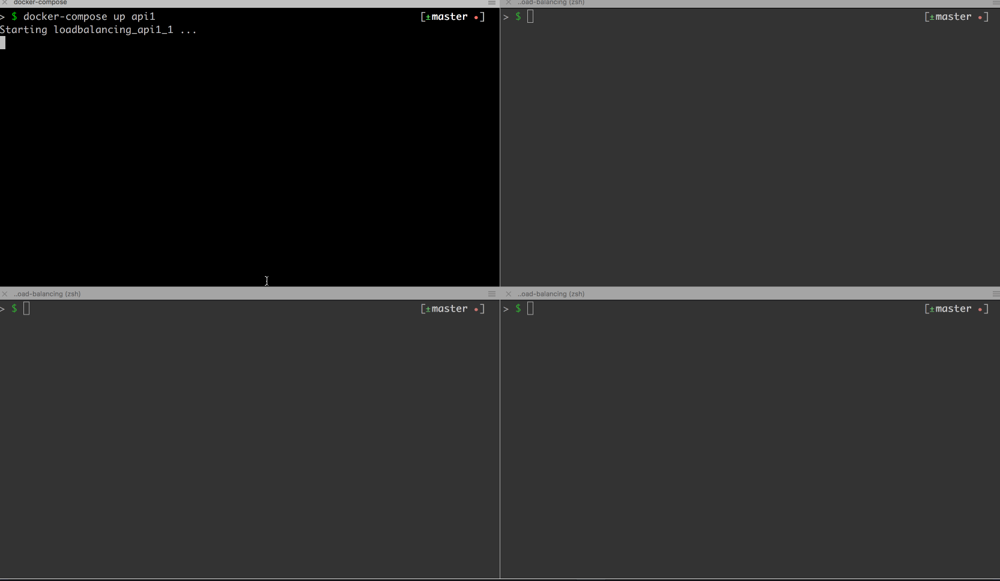

# NGINX - load balancing example

# Requirements
 - Docker
 - Docker-Compose

# How it works
Refer to commits to get explanation. :wink:

# Running it

Open the terminal and spin up the containers

```sh
  $ docker-compose up
```

Open another terminal window and run the follow command twice:

```sh
  $ curl http://localhost:8080
```

you'll see that Nginx will balance the server will respond the request.

Alternatively you can run each container in one window and see the requests as follow:


